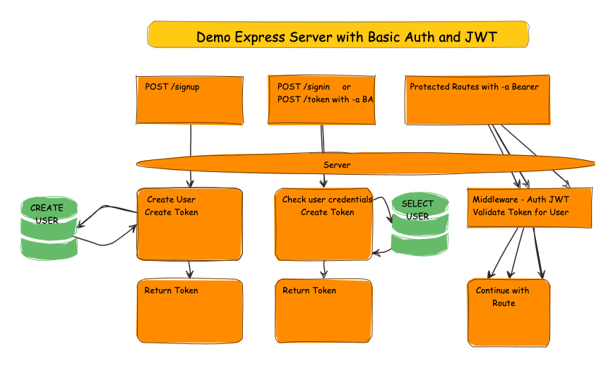

# Demo of Basic Auth with JWT Token sessions

This is a simple demo of a server that can create a user and login with Basic Authentication, then uses a JWT to authenticate after the user has logged in.

To create a user, POST to `/signup` with

    {
        "username": "yourname",
        "password": "yourpass"
    }

You will be sent a token. You can use the token to access the `/secret` route. To access it, you must supply the token in the Bearer Authentication scheme.

Some simple security features are employed like an exp claim for expiration of the token.

The demo server lives here:

[https://zero7-demo-basic-auth-with-jwt.onrender.com](https://zero7-demo-basic-auth-with-jwt.onrender.com)
